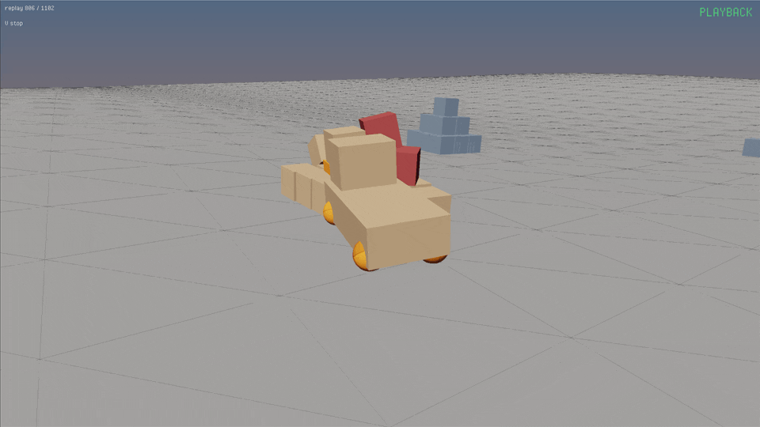

<sub>[hlbox3d](../README.md) › [Documentation](overview.md)</sub>

# The Driving sample

<p align="center">
    <a href="https://stepanzaletskiy.github.io/hlbox3d/"></a>
</p>
<p align="center">
    <a href="https://stepanzaletskiy.github.io/hlbox3d/">▶&nbsp; Play it in your browser</a>
</p>

[samples/](../samples/) is Box3D's own Driving sample, from its Joints
group, rebuilt on hlbox3d and drawn the way Box3D's window draws it: a
car on four wheel joints over rolling ground, in third person. On top of
Box3D's, a fork on the front makes it a forklift, there are pallets to
lift and crates to knock over, and the whole run can be recorded and
played back. It is the shortest complete program that uses most of the
library: bodies and compound shapes, a height field, four kinds of joint,
hit events, state colours, ray casts, recording and replay, on HashLink
and in the browser from the same files.

## Running it

HashLink, with `box3d.hdll` and `sdl.hdll` beside `hl`:

```
cd samples && haxe sample.hxml
cd ../build/samples && hl sample.hl
```

Browser:

```
cd samples && haxe sample_js.hxml
haxelib run hlbox3d install --web ../build/samples-web
cp sample.html ../build/samples-web/
```

then serve `build/samples-web` over http and open `sample.html`.

| Key | Does |
| --- | --- |
| W, S | throttle forward and back |
| A, D | steer |
| Space | handbrake: the rear wheels are held still |
| mouse | look about the car; the cursor is locked |
| wheel | nearer to the car, farther from it |
| left button | fork up |
| right button | fork down |
| F | start recording, stop recording |
| V | play the last recording, stop playing |
| R | start over |

The five lines in the corner are Box3D's own: the speed along the car,
then the spin speed and torque of the rear wheels and the steering angle
and torque of the front ones. Under them, how many crates the car has hit
and how long the tape is. RECORDING blinks in red while a tape runs;
PLAYBACK stands in green while one plays.

## The files

Each file is one thing, and `Main.hx` is the one to read first: it is
the whole game loop on one screen.

| File | What it is |
| --- | --- |
| [Main.hx](../samples/Main.hx) | the `hxd.App`: builds the world, and each frame steps it, or the tape, and moves the camera. |
| [Car.hx](../samples/Car.hx) | the vehicle: chassis, four wheel joints, the fork on its slider joint; the keys, and `drive`. |
| [Level.hx](../samples/Level.hx) | the ground, the pallets and the crates; the hits of each step and the red flash. |
| [Tape.hx](../samples/Tape.hx) | the recording and its replay: F and V. |
| [Replay.hx](../samples/Replay.hx) | draws a recording from the tape alone, one mesh a body, and flashes the crates that were struck. |
| [Camera.hx](../samples/Camera.hx) | Box3D's third person camera: yaw, pitch and radius about the car, the mouse and the wheel. |
| [Hud.hx](../samples/Hud.hx) | the text. |
| [Render.hx](../samples/Render.hx) | Box3D's picture: the sun, the sky, the state colours, the hull edges, the ground grid and the tone curve. |

`Render.hx` is the longest and the least about physics. A game with its own
renderer needs none of it; it is here so the two windows look alike, and
because state colours and hull edges are a good way to see what the
solver is doing.

## The loop

`Main.update` runs once a frame, and it is the whole game:

```haxe
override function update( dt : Float ) {
	if( hxd.Key.isPressed(hxd.Key.R) ) restart();
	if( hxd.Key.isPressed(hxd.Key.F) ) tape.record();
	if( hxd.Key.isPressed(hxd.Key.V) ) tape.play();

	if( tape.playing ) {
		if( tape.update(dt) ) {
			var at = tape.car();
			camera.follow(at[0], at[1], at[2], s3d.camera);
		}
	} else {
		car.control();
		tape.stepped(world.update(dt));
		level.update(dt, car, crate -> tape.mark(crate.name));
		camera.follow(car.body.object.x, car.body.object.y, car.body.object.z, s3d.camera);
	}
	hud.update(car, level, tape);
}
```

Line by line, in the live branch:

1. `car.control()` reads W, S, A, D, Space and the mouse buttons and
   turns them into joint settings: a target speed for the rear wheels'
   motor, a target angle for the front wheels' steering, a speed for the
   fork's slider. Nothing moves yet.
2. `world.update(dt)` steps the world. It takes as many sixty hertz steps
   as `dt` calls for, none on a fast frame and two on a slow one, then
   moves every attached object to where its body is, interpolated between
   the last two steps. It returns how many steps it took, and the tape
   counts them so that a hit can be written down against a frame.
3. `level.update` walks the contact events of those steps, counts the
   hits of the car against crates, lights them red, and tells the tape
   about each one; then it asks Box3D for the colour of every body whose
   state changed and paints it.
4. `camera.follow` moves the pivot to the drawn car and puts the eye on
   the scene's camera.

In the replay branch the live world is not stepped at all; `tape.update`
steps the hidden one instead, and the camera follows the recorded car,
found on the tape by its name. `hud.update` writes the text for either.

`Main.build` is the rest: a world with eight worker threads, eight
substeps and gravity; then the level, then the car on the ground under
the origin, then an empty tape. Everything drawn goes under one `stage`
object, so `restart` is that object removed, the world disposed, and
`build` again.

## What each part of the library it shows

**The world and the step.** `Main.build` makes a `World` with eight
worker threads, sets eight substeps and gravity, and `Main.update` calls
`world.update(dt)` once a frame: the world steps at a fixed sixty hertz
however fast the screen runs and moves every attached object to an
interpolated position, so the drawing is smooth at any frame rate. The
camera follows `car.body.object`, the drawn position, rather than the
body's, which moves only at the step. See [simulation.md](simulation.md).

**Bodies and shapes.** `Car` and `Level` build every body with `world.add`
or `world.addBox`, add shapes to it with `body.box` and `body.sphere`,
and set density and friction on the shape. A pallet is one body of four
boxes; the car is a chassis box and a cab. `attach` gives each body its
meshes under the stage object, and a restart is one `stage.remove()` and
`world.dispose()`. See [simulation.md](simulation.md) and
[drawing.md](drawing.md).

**The ground.** `Level` makes a `HeightField.wave`, the same wave Box3D's
sample uses, fifty points square at four metres a cell and two metres
high, on a static body. Box3D keeps a height field y-up, so the body is
turned a quarter turn about x to lie flat in this z-up world; the same
turn puts a wheel's sphere the way Box3D's sample has it. `Level.floor`
finds the ground under a point with `world.ray`, to set things down on
it; `Level` draws the field's triangles in wire over the surface, as
Box3D's window does. See [collision.md](collision.md).

**Axes.** Box3D is y-up and this world is z-up, so a point read from
Box3D's sample goes from (x, y, z) to (x, -z, y), and a turn about the up
axis changes sign: their A steers plus, ours minus. Every place the
sample does this says so in a comment. See [loose_ends.md](loose_ends.md).

**Joints.** The car is the sample's reason to exist. Each wheel is a
`world.wheel` joint with a suspension limit and spring; the rear pair have
a spin motor and the front pair a steering motor with a steering limit,
set through `joint.set` and the `Property.WHEEL_*` codes. A
`world.parallel` joint to the ground keeps the chassis upright without
holding it up. The fork is a `world.slider` joint along the car's up,
with a limit for its travel and a motor that both moves it and holds it
where it is. `Car.drive` is where a frame's input becomes joint
settings, and two things there are worth a look. The handbrake is not a
brake: it sets the rear motor's speed to zero and gives it ten times the
torque, so the wheels are held rather than slowed. And the steering lock
closes as the fork rises, a quarter turn with it down and a third of that
at the top, as a real forklift's does, from `lift.read()` and the joint's
`position`. The five lines of the readout come from `joint.get` with the
`Property.WHEEL_*` codes. See the joints section of
[simulation.md](simulation.md).

**Events.** Only the crates call `shape.reportHits()`, since hit events
cost something and most shapes never need them. After the step,
`Level.update` walks `world.contacts()` and keeps the hits between a
crate and the car above two metres a second. See the events section of
[simulation.md](simulation.md).

**State colours.** `Render.states` asks `world.bodyColors` for the colour
Box3D gives each body's state, tan awake, slate asleep, orange when
moving fast enough for continuous collision, and it answers only for the
bodies that changed. This is what Box3D's own window shows, and the
quickest way to see sleeping work.

**Recording and replay.** `Tape.record` gives the world a `Recording`;
everything the world is told from then on goes onto it. `Tape.play`
hands the tape to a `Player`, which replays it in a hidden world of its
own, and `Replay` draws that world from what the player says: where each
body is and the triangles of its shapes. Nothing of the live scene is
used, which is why a recording sent with a bug report is enough to see
the bug.

Two details make the replay match the live run. Bodies on a tape are
numbered in the order they were made, so the car and the crates are
given names, `car` and `crate` plus the body id, and the replay finds
them by name rather than by number. And a recording holds what the world
was told, not what the game did with it: the red flashes are the game's,
so `Tape.mark` writes each hit down by tape frame and crate name, and
`Replay` paints them red at the same frames. See
[recording.md](recording.md).

**Two targets.** `sample.hxml` builds for HashLink and `sample_js.hxml`
for the browser from the same files. The one difference is in `main()`:
on the web the wasm module has to load before the first world can exist,
so `box3d.Wasm.load()` comes first. See [web.md](web.md).

## Numbers worth knowing

Box3D's sample car weighs six kilos at its densities and its motors
five newton metres. This one is a car of a tonne and a half, so the
motors get two hundred and fifty times the torque, and the wheels are a
hundred kilos each: a chassis seventy times heavier than its wheel is a
mass ratio the joints stretch under, fourteen times is not. The world
runs eight substeps instead of four because a load on the fork hangs two
metres out on a single joint, and Box3D's soft constraints hold it the
steadier the more substeps they get. A crate is fifty kilos, a pallet's
crate two hundred, so the one rides the fork and the other flies off it.

## Making it yours

The sample is meant to be taken apart. Drop `Render.hx` and the `render`
override for your own renderer; keep `Car.hx` for a vehicle; keep
`Tape.hx` and `Replay.hx` for a replay of your own game, they depend on
nothing in the sample but `Render.paint`. A body's own model goes in place
of what `attach` drew, see [drawing.md](drawing.md).

---

<sub>← [First world](first_world.md) · [Documentation](overview.md) · [Simulation](simulation.md) →</sub>
